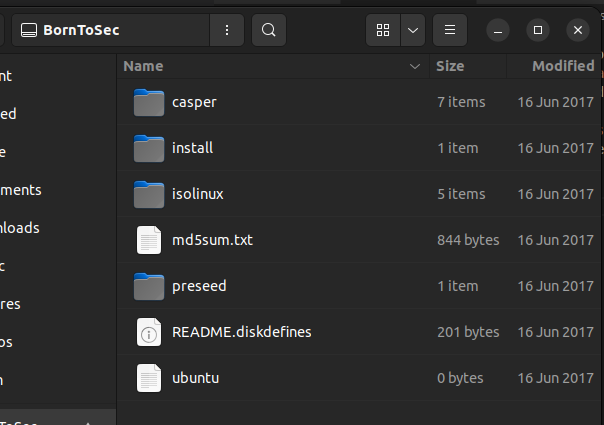
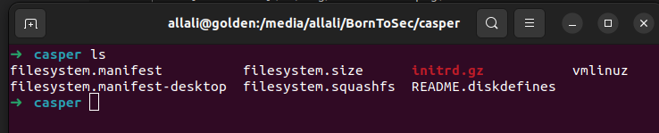
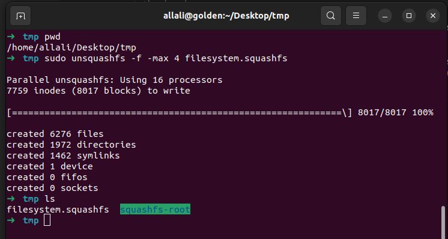
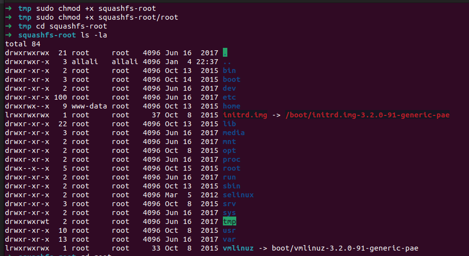
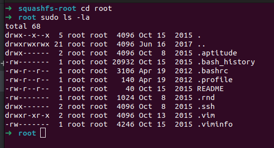
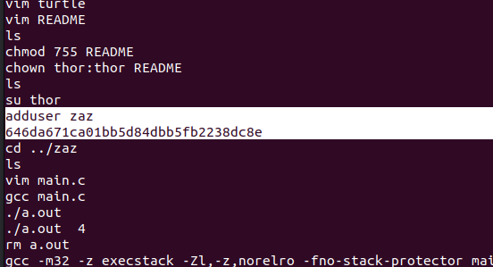

## UnSquashfs / Squashfs
since we have an image of that boot2root system which is in the ISO given 
- we will extract the `filesystem.squashfs` with the premission attached.
- and then either decrypt the passwords there (like snowcrash) or dig into what's left by the sysadmin, and many other ways.
- for our situation, we read the `.bash_history` and found the password of 
user `zaz` (from what the root user were typing when costumizing the image)

#### steps : 
- mount the iso image and go to the mount folder.

    
- open the casper file, you will find something there (hhhhh of course u will find something).
    
- copy the `filesystem.squashfs` file outside the mount folder because we cant operate there due to permissions `mkdir ~/Desktop/tmp && cp filesystem.squashfs ~/Desktop/tmp && cd ~/Desktop/tmp`.
- execute the following command **`sudo unsquashfs -f -max 4 filesystem.squashfs`**.
    
- notice that we got a new fodler called `squashfs-root`.
- chmod it as well as the `root` folder to get permission to list items inside.
    
- go inside the root folder.

    
- read the `.bash_history` file that contains the history of commands executed on the shell, after some time of searching we notice an `adduser` command with the name `zaz` and the password `646da671ca01bb5d84dbb5fb2238dc8e`
    

- well we got the user zaz
    ```txt
    zaz
    646da671ca01bb5d84dbb5fb2238dc8e
    ```
- log with it, we get into the user zaz shell, an `exploit_me` executable is there, you can exploit it and congrats you get the root shell.


#### Command params explanation:
***`sudo unsquashfs -f -max 4 filesystem.squashfs`***
- -f, -force
    - if file already exists then overwrite.
- -max LEVELS, -max-depth LEVELS
    - descend at most LEVELS of directories when extracting or listing.
#### Ressources:
- the command `unsquashfs` : https://manpages.debian.org/testing/squashfs-tools/unsquashfs.1.en.html
- What is `filesystem.squashfs` : https://unix.stackexchange.com/questions/287446/what-is-filesystem-squashfs-and-why-does-it-take-so-long-to-load-on-to-bootable
- SquashFS : https://en.wikipedia.org/wiki/SquashFS
