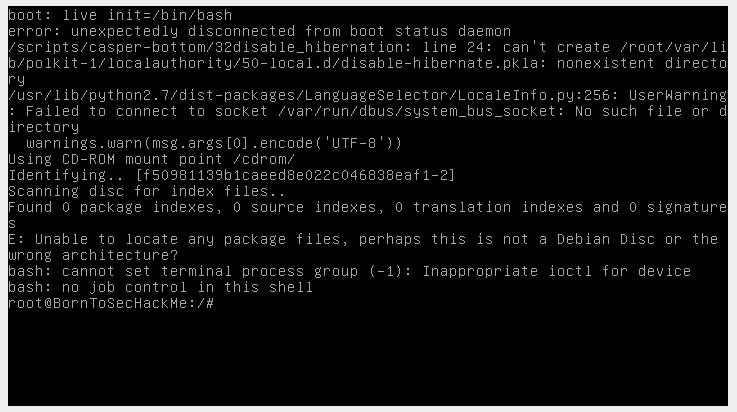

# boot to shell 
for this exploit, we will use the pre boot phase to run a command.
- when you run the machine, keep SHIFT pressed
- the word `boot` will prompt
- enter the following command : `live init=/bin/bash`
- congrats the shell :)

